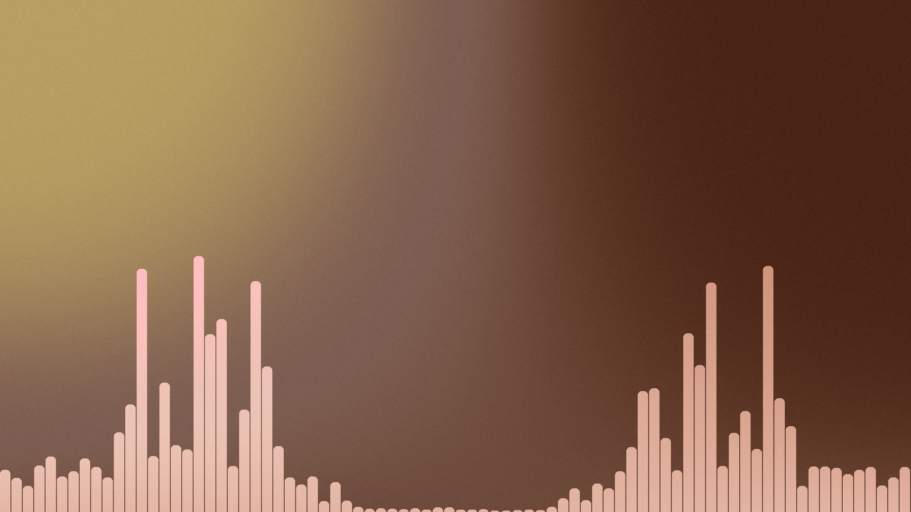

# Cazam
A simple and modern frontend for [cava](https://github.com/karlstav/cava)

Using local files for palette generation currently only works on linux, but it should be easy to add for other systems.

# Requirements
- cava installed on your system
- uv installed on your system

# How to run
1. Clone the repository
2. Open a terminal inside the folder you downloaded
3. run **uv run main.py**

# How to configure
- Take a look at the cazam.conf file in the config folder (~/.config/Cazam on Linux)
- Edit it and rerun the program
- To reset the config file, just delete it and rerun the program
- Set use_local_cover_palette to 1 in order to extract the cover image from your local music 
files and use that to generate the color palette (folder can be changed)

# Images

